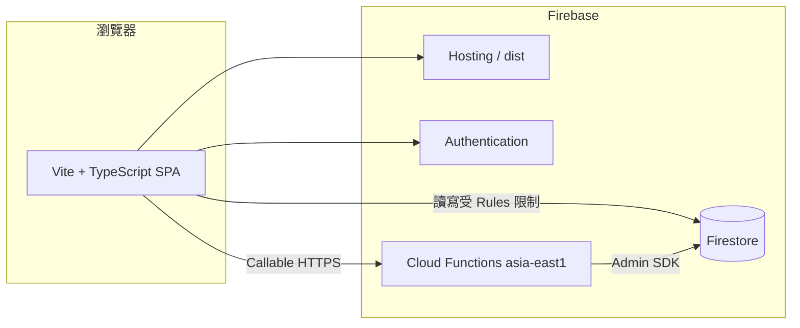
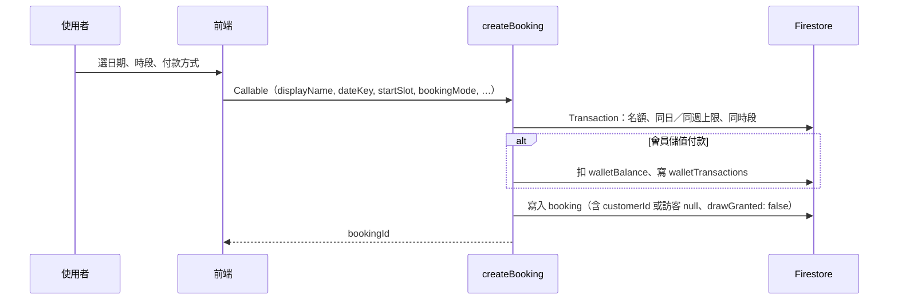
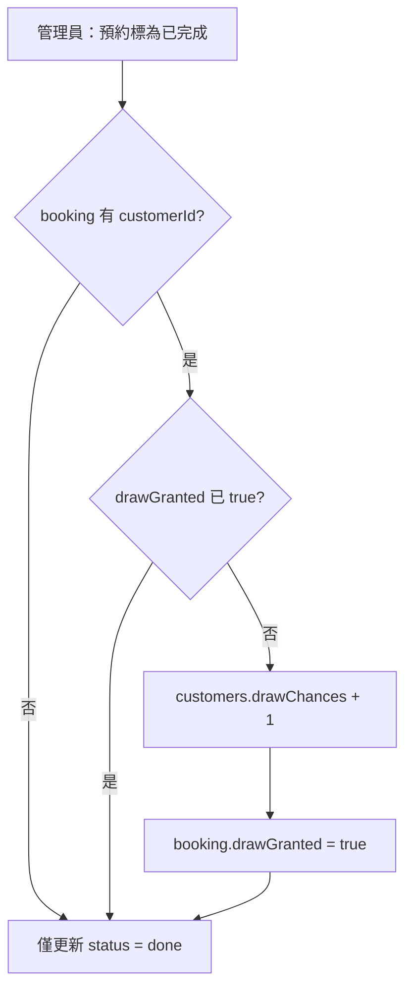
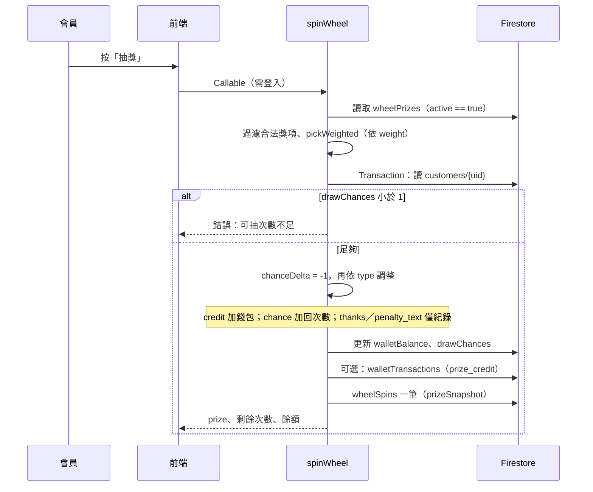

# 線上預約系統：架構與流程說明

本文描述 **辦公室按摩預約** 專案的整體架構、主要元件與端到端流程（含輪盤抽獎）。實作以倉庫內程式為準；細部產品規格可另參考 [`prepaid-wheel-mvp-plan.md`](./prepaid-wheel-mvp-plan.md)。

---

## 1. 概述

本系統為 **單頁應用（SPA）**，部署於 **Firebase Hosting**，業務規則與敏感寫入集中在 **Cloud Functions（Callable）** 與 **Firestore Security Rules**。一般訪客可匿名查空檔與建立預約；會員以 **Authentication（Email／密碼）** 登入後可使用儲值、查看自己的預約、抽輪盤；具 **`admins/{uid}`** 文件者為管理員，可於後台檢視所有預約、變更狀態、儲值、建立會員等。

---

## 2. 系統架構

| 層級 | 技術 | 說明 |
|------|------|------|
| 前端 | Vite、TypeScript、Firebase JS SDK | 入口 `src/main.ts`，Firebase 封裝 `src/firebase.ts` |
| 託管 | Firebase Hosting | `firebase.json`：`public: dist`，SPA 全導向 `index.html` |
| 後端 | Cloud Functions v2 `onCall` | 原始碼 `functions/src/index.ts`，區域 **`asia-east1`**（與前端 `getFunctions(..., "asia-east1")` 一致） |
| 資料 | Firestore | 規則 `firestore.rules`，索引 `firestore.indexes.json` |
| 驗證 | Firebase Auth | Email／密碼；管理員與一般會員共用，以 `admins` 集合區分權限 |

### 2.1 目錄對照

| 路徑 | 用途 |
|------|------|
| `src/` | 預約表單、跑馬燈、會員登入、輪盤 UI、管理後台 UI |
| `functions/src/index.ts` | 所有 Callable、Firestore 觸發器（預約狀態變更寄信） |
| `functions/src/bookingLogic.ts` | 時段、容量、週曆規則（與前端 `src/slots.ts` 對齊概念） |
| `functions/src/resendNotify.ts` | Resend：新預約通知擁有者、會員預約狀態變更信（由 `createBooking`／觸發器呼叫） |
| `scripts/seed-wheel-prizes.mjs` | 本機／CI 呼叫 `seedWheelPrizes` 初始化獎項 |
| `.github/workflows/deploy-firebase.yml` | 推送 `main` 時建置並部署（需 `FIREBASE_TOKEN`） |

---

## 3. Firestore 資料模型（主要集合）

以下為後端與前端會碰到的主要集合（`admins` 無客戶端讀寫規則，由 Functions 讀取）。

| 集合 | 用途 |
|------|------|
| `bookings` | 預約主檔：`status`、`customerId`、`drawGranted`、付款欄位等 |
| `customers` | 會員（以 Auth `uid` 為文件 ID）：`walletBalance`、`drawChances`、`nickname` 等 |
| `walletTransactions` | 錢包異動紀錄（扣款、儲值、退款、輪盤獎勵等） |
| `wheelPrizes` | 輪盤獎項設定：`active`、`type`、`value`、`weight` |
| `wheelSpins` | 每次抽獎結果與 `prizeSnapshot` |
| `admins` | 管理員白名單（文件 ID = Auth UID） |
| `siteSettings` | 網站公告／跑馬燈等（規則：公開讀、管理員寫） |
| `siteStats` | 訪次聚合（如 `visitorCounters`；由 `recordSiteVisit` 以交易累加） |
| `supportThreads` | 客服對話主檔；子集合 `messages` 為往來訊息 |

**預約狀態**（後台可選）：`pending` → `confirmed` → `done`；另有 `cancelled`、`deleted`（軟刪相關欄位依規則與實作）。

**`drawGranted`**：同一筆預約僅能透過「完成預約」流程發放 **一次** 抽獎次數，避免重複 +1。

---

## 4. Callable Functions 一覽

所有可呼叫函式定義於 `functions/src/index.ts`，前端封裝於 `src/firebase.ts`（不含 `seedWheelPrizes`，該項通常由腳本呼叫）。

| 函式 | 誰可呼叫 | 用途摘要 |
|------|-----------|----------|
| `getAvailability` | 公開 | 依 `dateKey` 回傳可預約時段（已佔用時段由後端計算） |
| `recordSiteVisit` | 公開 | 訪次統計（`siteStats/visitorCounters`，台北日曆日／週）；前端每瀏覽器分頁工作階段建議最多呼叫一次 |
| `createBooking` | 公開（會員模式需登入） | 建立預約、名額檢查、會員錢包扣款等；可搭配 Resend 通知擁有者 |
| `getMyWallet` | 已登入 | 讀取自己的餘額、可抽次數、暱稱 |
| `getAdminStatus` | 已登入 | 是否為管理員 |
| `completeBooking` | 管理員 | 將預約標為完成；符合條件時 **顧客 `drawChances + 1`** |
| `cancelBooking` | 預約本人或管理員 | 取消預約；若曾錢包扣款則退款 |
| `topupWallet` | 管理員 | 後台儲值 |
| `createMemberAccount` | 管理員 | 建立 Auth 使用者 + `customers` 初始文件 |
| `searchMemberUsers` / `listMembersAdmin` / `updateMemberNicknameAdmin` | 管理員 | 會員搜尋、列表、暱稱 |
| `listActiveWheelPrizes` | 已登入且 **Email 已驗證** | 列出啟用中獎項（供輪盤 UI） |
| `spinWheel` | 已登入且 **Email 已驗證** | 消耗可抽次數、加權隨機獎項、更新餘額與紀錄 |
| `seedWheelPrizes` | 需已登入且為 **admin** | 若 `wheelPrizes` 為空則寫入預設獎項 |
| `sendSupportChatMessage` | 已登入（會員或 **匿名**） | 顧客送客服訊息或重新開啟對話（`supportThreads` / `messages`） |
| `sendSupportChatAdminReply` | 管理員 | 管理員回覆客服訊息 |
| `setSupportThreadStatusAdmin` | 管理員 | 將客服對話標為 `open` / `closed` |

**非 Callable（觸發器）**：`notifyMemberBookingStatusChange` 為 Firestore **`onDocumentUpdated("bookings/{bookingId}")`**。當預約 **`status`** 變更、且為會員預約（非訪客模式、有 `customerId`）時，透過 **Resend** 寄信給該會員；實際寄送邏輯見 `functions/src/resendNotify.ts`，需設定 Functions 的 `RESEND_API_KEY`（等）與相關 secret。

---

## 5. 安全模型（重點）

- **`firestore.rules`**：`bookings` 僅 **管理員** 或 **`customerId == request.auth.uid` 的本人** 可讀；**建立／刪除** 關閉，**更新** 僅管理員且僅限特定欄位（狀態、軟刪等）。因此一般預約建立 **不走** 客戶端直接 `addDoc`，而走 **`createBooking` Callable**（Admin SDK 寫入）。
- **`customers`、`walletTransactions`、`wheelPrizes`、`wheelSpins`**：規則檔中未對一般使用者開放直接寫入；餘額與抽獎次數應僅由 **Functions** 更新。
- **管理員**：後端以 `admins/{uid}` **存在與否** 判斷（例如 `completeBooking`、`topupWallet`）。

---

## 6. 核心流程

### 6.1 預約建立（`createBooking`）

- **訪客**（`guest_cash` / `guest_beverage`）：通常 **無 `customerId`**，完成預約後 **不會** 發抽獎次數。
- **會員**（現金／飲料折抵／儲值）：會寫入 **`customerId = uid`**（或錢包扣款流程），完成預約後才可能 **+1 抽獎次數**。

時段與容量規則由 `functions/src/bookingLogic.ts` 與 `createBooking` 內交易邏輯強制（週一至週五、`Asia/Taipei`、午休時段排除、每日最多 2 筆、每工作週最多 4 筆等）。

### 6.2 管理後台：完成預約與發放抽獎次數（`completeBooking`）

- 若 **`customerId` 為空**，不增加抽獎次數。
- 若已發過（**`drawGranted === true`**），不重複 +1。

### 6.3 取消預約（`cancelBooking`）

- **預約本人**（`customerId === uid`）或 **管理員** 可取消。
- 若預約曾 **`walletDeducted > 0`**，於交易中 **退回餘額** 並寫入 **`walletTransactions`（refund）**。

### 6.4 輪盤抽獎（`spinWheel`）— 詳細流程

**獎項型別 `type`（後端白名單）**

| `type` | 行為概要 |
|--------|-----------|
| `credit` | 增加 `walletBalance`，並寫入 `walletTransactions`（`prize_credit`） |
| `chance` | 增加 `drawChances`（例如「再抽一次」：`chanceDelta` 在 -1 基礎上 +value，常見為淨消耗 0 次） |
| `thanks` | 銘謝惠顧：不調整餘額，仍消耗本次抽獎（預設 -1 次） |
| `penalty_text` | 文案類：同上不調整餘額 |

**加權隨機**：`pickWeighted` 以所有啟用獎項的 `weight` 總和為底，`Math.random() * total` 決定中獎項。

**初始化獎項**：`wheelPrizes` 為空時可執行 `seedWheelPrizes` 或專案內 `scripts/seed-wheel-prizes.mjs`；詳見根目錄 `README.md`。

### 6.5 會員錢包（`getMyWallet` / `topupWallet`）

- **`getMyWallet`**：回傳目前登入者的 `walletBalance`、`drawChances`、暱稱。
- **`topupWallet`**：僅管理員；增加餘額並寫入儲值交易（不直接增加抽獎次數）。

---

## 7. 前端畫面分工（概念）

- **預約**：呼叫 `getAvailability`、`createBooking`；訪客／會員付款選項見 `BookingMode`。
- **訪次**：首載可呼叫一次 `recordSiteVisit`（每分頁工作階段建議不重複）。
- **登入／會員**：Auth 狀態變化時刷新 `getMyWallet`、啟用或停用輪盤按鈕。
- **輪盤**：先 `listActiveWheelPrizes`（已驗證會員）再抽；`spinWheel` 成功後顯示獎項並刷新錢包狀態。
- **客服**：會員或匿名訪客透過 `sendSupportChatMessage`；後台以 `sendSupportChatAdminReply`、`setSupportThreadStatusAdmin` 回覆與結案。
- **管理**：`onSnapshot` 訂閱 `bookings`（僅管理員可讀規則允許之資料）；狀態更新透過 `updateDoc` 與規則允許之欄位，或使用 Callable（依實作）— **完成／取消** 以 **`completeBooking` / `cancelBooking`** 為準（與發放次數、退款一致）。

---

## 8. 測試與部署

- **E2E**：`tests/e2e/`（例如會員預約 → 後台完成 → 抽輪盤）；環境變數見 `README.md` 與 `.env.e2e.example`。
- **部署**：`npm run build` 後 Firebase CLI 部署 Hosting + Functions；CI 見 `.github/workflows/deploy-firebase.yml`。

---

## 9. 相關文件

- [`README.md`](../README.md)：本機開發、Firebase 初始化、索引、輪盤獎項範例欄位。
- [`prepaid-wheel-mvp-plan.md`](./prepaid-wheel-mvp-plan.md)：預付／輪盤 MVP 規劃與權重建議。

若後續調整規則（例如「儲值也送抽獎次數」或「完成預約改由客戶端觸發」），請同步更新 **Functions**、**Rules** 與本文件。
